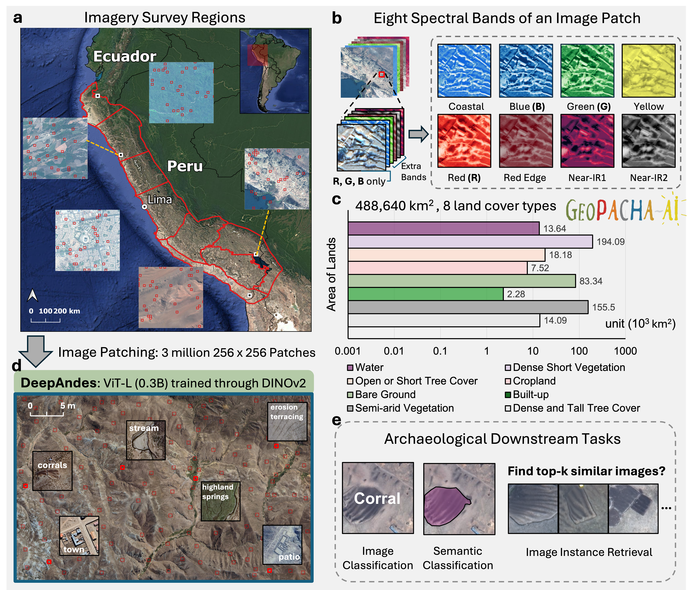
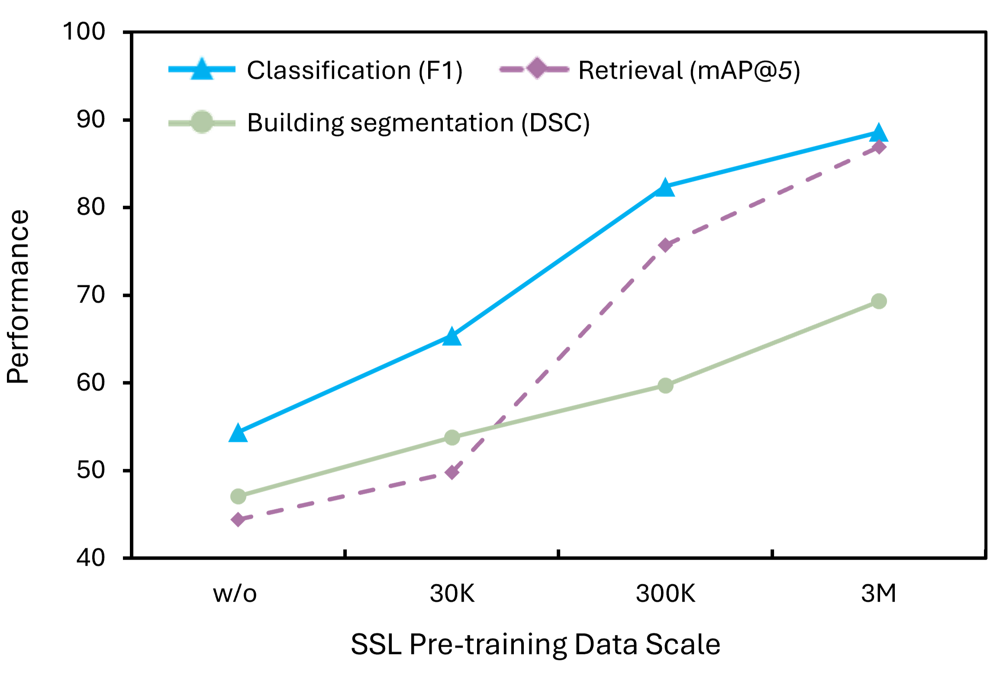
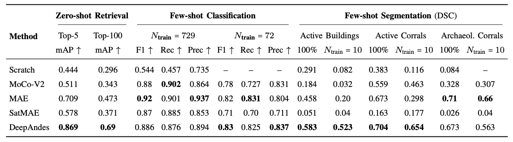

# DeepAndes: A Self-Supervised Vision Foundation Model for Multi-Spectral Remote Sensing Imagery of the Andes  (IEEE JSTARS2025)
> **DeepAndes** is the *first* vision foundation model that applies the **DINOv2** self-supervised learning framework and large-scale pre-training on **multi-spectral satellite imagery** specifically for the **Andes region**.


<a href='https://arxiv.org/abs/2504.20303'></a> 
<a href="https://ieeexplore.ieee.org/document/11196959">
  
</a>

## 🧭 Roadmap
This is an ongoing project for developing foundation models for the [GEOPACHA](https://geopacha.org/) web app.
- [ ] Updating the code for YOLO(ultralytics) object detection head (**in progress**)
- [ ] Exploring the next-line *[**DINOv3**](https://github.com/facebookresearch/dinov3/tree/main)* model (**in progress**)
- 🌎 Extend pre-training to Full Andes Regions (100x more data) (**in progress**)
- 🔗 Integrate geospatial metadata and language models (**next step**)


## 📢 Latest Updates
🔥 🔥 🔥 Last Updated on 2025.10.23 🔥 🔥 🔥
- **[2025.10.23]** Pre-trained ViT-L/14 backbone weight is released ([Google Drive](https://drive.google.com/drive/folders/1-9XMSWyto_-3Rh7U4ObdjhgETvZkZ9PD?usp=sharing)). 
- **[2025.10.02]** Our paper has been **accepted** for publication in the IEEE Journal of Selected Topics in Applied Earth Observations and Remote Sensing (**IEEE JSTARS 2025**).



## Table of Contents
[Go to Highlights](#-highlights)

[Go to Acknowledgements](#-acknowledgements)


## 📌 Highlights

- **Foundation-model scale**: Trained on ~3 million multi-spectral satellite patches covering ~488,640 km² of the Andes.  
- **Multi-spectral (8-band) input**: Supports 8-band [WorldView-2](https://www.satimagingcorp.com/satellite-sensors/worldview-2/) and [WorldView-3](https://www.satimagingcorp.com/satellite-sensors/worldview-3/) satellite imagery instead of RGB.  
- **Self-supervised learning (SSL)**: Built upon **DINOv2**, adapted for geospatial feature scale and 8-channel inputs.  
- **Downstream versatility**: Evaluated on classification, retrieval, and segmentation under both full and few-shot (reduced) settings.

## ⚙️ Architecture & Pre-Training

- **Backbone**: Vision Transformer (ViT-L/14, ~304M parameters)  
- **Input**: 8-band image patches (256 × 256) sampled across diverse Andean terrains at 0.5 meter/pixel
- **SSL Framework**:  
  - DINOv2 (Contrastive Learning + Distillation)
  - Multi-crop global/local view strategy 
  - Channel adaptation for 8-band input  
  - Large-scale geospatial sampling  
- **Dataset**: ~3M patches across 8 land-cover types (~488 k km² coverage)


## 🚀 Quick Start
<!-- ## 🎯 About This Repository -->
This repo contains pre-trained weight ([Google Drive](https://drive.google.com/drive/folders/1-9XMSWyto_-3Rh7U4ObdjhgETvZkZ9PD?usp=sharing)), codes and example scripts for downstream tasks with DeepAndes backbone.


### Use Pre-trained backbone (via Pytorch Hub)
See the instructions to install [Pytorch](https://pytorch.org/get-started/locally/) (the only required dependency for loading the model). [xFormers](https://github.com/facebookresearch/xformers) is also installed for mem-efficient attention. An example of Pytorch 2.8.0 with CUDA 12.8 and xformers installation are provided [here](dinov2_ssl_8bands/README.md#installation).

```python
# checkpoint
checkpoint = '/path/to/model/teacher_checkpoint.pth'
model = torch.hub.load('facebookresearch/dinov2', 'dinov2_vitl14')  

pretrained_dict = torch.load(checkpoint, map_location="cpu")
checkpoint_key = 'teacher'
new_state_dict = {}
for k, v in pretrained_dict[checkpoint_key].items():
    if 'dino_head' in k:
        print(f'{k} not used')
    elif 'ibot_head' in k:
        print(f'{k} not used')
    else:
        new_key = k.replace('backbone.', '')
        new_state_dict[new_key] = v

# ViT-L/14 with 224×224 input (8-band) → 257 tokens (256 patches + 1 cls), 1024 dims
pos_embed = nn.Parameter(torch.zeros(1, 257, 1024))
model.pos_embed = pos_embed

new_patch_embed = model.patch_embed
new_patch_embed.proj = nn.Conv2d(
    in_channels=8,  # Updated for 8 input bands
    out_channels=new_patch_embed.proj.out_channels,
    kernel_size=new_patch_embed.proj.kernel_size,
    stride=new_patch_embed.proj.stride,
    padding=new_patch_embed.proj.padding,
)
model.patch_embed = new_patch_embed
model.load_state_dict(new_state_dict, strict=True)
```
**E.g., Adding a simple linear classifer head** 
```python
# add linear classification head
model.head = nn.Sequential(
    nn.Linear(1024, 256),
    nn.ReLU(),
    nn.Linear(256, 2)
)
```
----
### Launch Pre-training 
Please refer to [**dinov2_ssl_8bands/README.md**](dinov2_ssl_8bands/README.md) for detailed installation ([here](dinov2_ssl_8bands/README.md#installation)), dataset setup, and key modifications supporting any number (e.g., this work is 8) of image bands.

Run on Multi-GPUs (without SLURM): 
```
CUDA_VISIBLE_DEVICES=0,1,2,3,4,5,6,7 torchrun --nproc_per_node=8 \
    /path/to/dinov2_ssl_8bands/dinov2/train/train_8bands.py \
    --output-dir /path/to/output_dir \
    --config-file /path/to/config_file.yaml \
    --ssl-data /path/to/dataset/folder \
    --wandb-trial <name_of_the_run> \
    --wandb-project <name_of_the_project>
```
replace the CUDA_VISIBLE_DEVICES and nproc_per_node with specific multi-gpus settings. (e.g., training on 8 A100-80GB GPUs)

Run on Single GPU (without SLURM):
```
python /path/to/dinov2_ssl_8bands/dinov2/train/train_8bands.py \
    --output-dir /path/to/output_dir \
    --config-file /path/to/config_file.yaml \
    --ssl-data /path/to/dataset/folder \
    --wandb-trial <name_of_the_run> \
    --wandb-project <name_of_the_project>
```
An example <u>training logs</u> is provided here: 

- [training_metrics (wandb snapshot)](configs/ssl_pretraining/training_metrics_wandb.png)  
- [training_metrics (json format)](configs/ssl_pretraining/training_metrics.json)

---
### Fine-tuning: Classification 
See the [**classification_eval/README.md**](classification_eval/README.md) for setup details and baseline comparisons. E.g., To fine-tune `deepandes` using binary classification dataset. 

```bash
python ./classification_eval/linear_prob_simple_args.py \
    --use_wandb \
    --wandb_project <wandb_project_name> \
    --wandb_trial <wandb_run_name> \
    --train_dataset_str /path/to/train_dataset_dir \
    --val_dataset_str /path/to/val_dataset_dir \
    --output_dir /path/to/output_dir \
    --epochs 10 \
    --model_name deepandes \
    --pretrained_weights /path/to/teacher_checkpoint.pth
```
### Image to Image Retrieval 


## 📊 Downstream Evaluation Results

### Scaling Law Behavior
Scaling laws are observed as the pretraining scale increases from none to 30K, 300K, and 3M images, highlighting DeepAndes’ scalability and performance gains with more data.

<div align="center">

</div>

### Zero- and Few-shot Evaluation 

We benchmark DeepAndes against representative baselines: a Scratch model, self-supervised backbones (MoCo-V2, MAE), and SatMAE—a domain-specific remote sensing model.

- **Zero-shot image retrieval**: Top-5 and Top-50 mAP
- **Few-shot classification**: F1, Recall, and Precision
- **Few-shot segmentation**: Dice Similarity Coefficient (DSC), with a frozen backbone and a linear segmentation head

Few-shot results are reported on both the full training set and a highly constrained setting  (N_train = 72 for classification, N_train = 10 for segmentation) to simulate data-limited conditions.




<!-- ## 📂 Folder Structure -->
## Citation
If you find this repository useful, please consider giving a star ⭐ and citation 🦖 Thank you:)

```
@article{guo2025deepandes,
  title={DeepAndes: A Self-Supervised Vision Foundation Model for Multi-Spectral Remote Sensing Imagery of the Andes},
  author={Guo, Junlin and Zimmer-Dauphinee, James R and Nieusma, Jordan M and Lu, Siqi and Liu, Quan and Deng, Ruining and Cui, Can and Yue, Jialin and Lin, Yizhe and Yao, Tianyuan and others},
  journal={arXiv preprint arXiv:2504.20303},
  year={2025}
}
```

## 🤝 Acknowledgements
Supported by the [GeoPACHA Project](https://geopacha.org/) and collaborators at Vanderbilt University, Brown University, and ORNL.
Special thanks to all contributors from the Andean Archaeology and Remote Sensing communities.

## 📫 Contact & Contribution
For questions or contributions, open an issue or pull request. We are looking forward to your feedback!

Contact: Junlin Guo (junlinguo1@gmail.com), Yuankai Huo (PI)(yuankai.huo@vanderbilt.edu), Steven Wernke (PI)(s.wernke@Vanderbilt.Edu), and Parker VanValkenburgh (parker_vanvalkenburgh@brown.edu)
