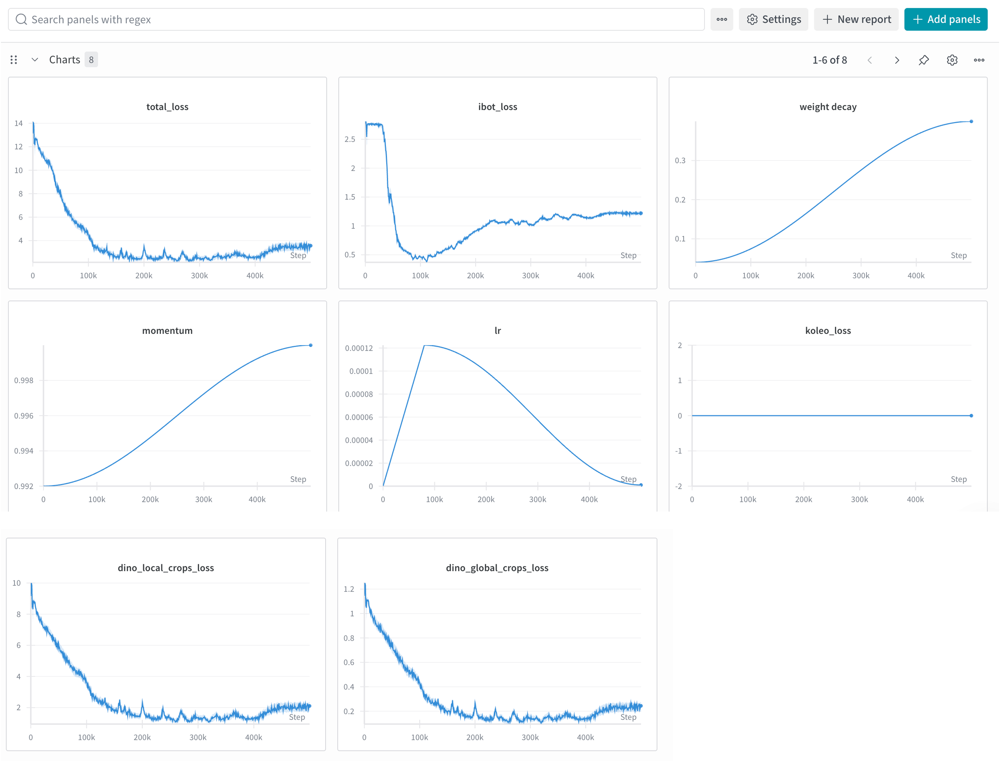

# DeepAndes: A Self-Supervised Vision Foundation Model for Multi-Spectral Remote Sensing Imagery of the Andes  (IEEE JSTARS2025)
> **TL;DR**: **DeepAndes** is the *first* vision foundation model that applies the **DINOv2** self-supervised learning framework and large-scale pre-training on **multi-spectral satellite imagery** specifically for the **Andes region**.


<p align="center">
  
</p>

<p align="center">
<a href='https://arxiv.org/abs/2504.20303'></a> 
<a href="https://ieeexplore.ieee.org/document/11196959">
  
</a>
</p>
<p align="center">
  <a href="#-roadmap">Roadmap</a> |
  <a href="#-latest-updates">Lastest Updates</a> |
  <a href="#-highlights">Hightlights</a> |
  <a href="#%EF%B8%8F-architecture">Architecture</a> |
  <a href="#-quick-start">Quick Start</a> | 
  <a href="#-downstream-evaluation-results">Results</a> | 
  <a href="#citation">Citation</a> |
  <a href="#-acknowledgements">Acknowledgements</a>
</p>


## 🧭 In-Progress
This is an ongoing project for developing foundation models for the [GEOPACHA](https://geopacha.org/) web app.
- Next-line *[**DINOv3-based-8bands**](https://github.com/facebookresearch/dinov3/tree/main)* ***DeepAndesV2*** model (***Trained, Paper In-Progress***)
- Extend pre-training scale to Full Andes Regions (100x more data in SSL) (***Model coming soon***)

## 📢 Latest Updates
🔥 🔥 🔥 Last Updated on 2026.09.05 🔥 🔥 🔥
- **[2025.10.23]** 3-million DeepAndes ViT-L/14 backbone [pretrained weight (google drive)](https://drive.google.com/drive/folders/1-9XMSWyto_-3Rh7U4ObdjhgETvZkZ9PD?usp=sharing) is released, check [quick-start](#use-pre-trained-backbone-via-pytorch-hub)
- **[2025.10.02]** Our paper has been **accepted** for publication in the IEEE Journal of Selected Topics in Applied Earth Observations and Remote Sensing (**IEEE JSTARS 2025**).


## 📌 Highlights

- **Foundation-model scale**: Trained on ~3 million multi-spectral satellite patches covering ~488,640 km² of the Andes.  
- **Multi-spectral (8-band) input**: Supports 8-band [WorldView-2](https://www.satimagingcorp.com/satellite-sensors/worldview-2/) and [WorldView-3](https://www.satimagingcorp.com/satellite-sensors/worldview-3/) satellite imagery instead of RGB.  
- **Self-supervised learning (SSL)**: Built upon **DINOv2**, adapted for geospatial feature scale and 8-channel inputs.  
- **Downstream versatility**: Evaluated on classification, retrieval, and segmentation under both full and few-shot (reduced) settings.

## ⚙️ Architecture

- **Backbone**: Vision Transformer (ViT-L/14, ~304M parameters)  
- **Input**: 8-band image patches (256 × 256) sampled across diverse Andean terrains at 0.5 meter/pixel
- **SSL Framework**:  
  - DINOv2 (Contrastive Learning + Distillation)
  - Multi-crop global/local view strategy 
  - Channel adaptation for 8-band input  
  - Large-scale geospatial sampling  
- **Dataset**: ~3M patches across 8 land-cover types (~488 k km² coverage)


## 🚀 Quick Start
<!-- ## 🎯 About This Repository -->
This repo contains [pretrained weight (google drive)](https://drive.google.com/drive/folders/1-9XMSWyto_-3Rh7U4ObdjhgETvZkZ9PD?usp=sharing), codes and example scripts for downstream tasks with DeepAndes backbone:
  - [Use Pre-trained backbone (via Pytorch Hub)](#use-pre-trained-backbone-via-pytorch-hub)
  - [Launch Pre-training](#launch-pre-training)
  - [Zero-shot: Image to Image Retrieval](#zero-shot-image-to-image-retrieval)
  - [Few-shot Fine-tuning: Classification](#fine-tuning-classification)
  - [Few-shot Fine-tuning: Segmentation](#fine-tuning-segmentation)


### Use Pre-trained backbone (via Pytorch Hub)
See the instructions to install [Pytorch](https://pytorch.org/get-started/locally/) (the only required dependency for loading the model). [xFormers](https://github.com/facebookresearch/xformers) is also installed for mem-efficient attention. An example of Pytorch 2.8.0 with CUDA 12.8 and xformers installation are provided [here](dinov2_ssl_8bands/README.md#installation).

```python
import torch
import torch.nn as nn

# checkpoint
checkpoint = '/path/to/model/teacher_checkpoint.pth'
model = torch.hub.load('facebookresearch/dinov2', 'dinov2_vitl14')  

pretrained_dict = torch.load(checkpoint, map_location="cpu")
checkpoint_key = 'teacher'
new_state_dict = {}
for k, v in pretrained_dict[checkpoint_key].items():
    if 'dino_head' in k:
        print(f'{k} not used')
    elif 'ibot_head' in k:
        print(f'{k} not used')
    else:
        new_key = k.replace('backbone.', '')
        new_state_dict[new_key] = v

# ViT-L/14 with 224×224 input (8-band) → 257 tokens (256 patches + 1 cls), 1024 dims
pos_embed = nn.Parameter(torch.zeros(1, 257, 1024))
model.pos_embed = pos_embed

new_patch_embed = model.patch_embed
new_patch_embed.proj = nn.Conv2d(
    in_channels=8,  # Updated for 8 input bands
    out_channels=new_patch_embed.proj.out_channels,
    kernel_size=new_patch_embed.proj.kernel_size,
    stride=new_patch_embed.proj.stride,
    padding=new_patch_embed.proj.padding,
)
model.patch_embed = new_patch_embed
model.load_state_dict(new_state_dict, strict=True)
```
**E.g., Adding a simple linear classifer head** 
```python
# add linear classification head
model.head = nn.Sequential(
    nn.Linear(1024, 256),
    nn.ReLU(),
    nn.Linear(256, 2)
)
```
#### Adapts DeepAndes 8-band model for 3-band input (experimental)

- Adapts patch_embedding from 8 channels to 3 channels after loading pre-trained weights.

- Note: Model was designed for 8-band Worldview imagery; 3-band adaptation is only <ins>experimental</ins>!

- We provide a [demo script](deepandes_for_3bands/model_load_adjust.py) in `deepandes_for_3bands`

  ```python
  # loading pretrained weight
  model.load_state_dict(new_state_dict, strict=True)

  # 2. adjust patch embedding for new_in_ch = 3 
  adapt_patch_embed_in_chans(model, new_in_ch=3, mode="mean")
  model.eval()
  ```

#### Torch hub Error (dinotxt)

If the error `ModuleNotFoundError: No module named 'dinov2.hub.dinotxt'` occurs while loading module, simply comment out the following line in the `~/.cache/torch/hub/facebookresearch_dinov2_main/hubconf.py` file:

```python
# from dinov2.hub.dinotxt import dinov2_vitl14_reg4_dinotxt_tet1280d20h24l
```
The [hubconf.py](configs/hubconf.py) we used is provided, copy and paste on the corresponding directory.
This is the config mis-match since we use the simple torch hub loading and adjust the pre-trained wieght. 

----
### Launch Pre-training 
Please refer to [**dinov2_ssl_8bands/README.md**](dinov2_ssl_8bands/README.md) for detailed installation ([here](dinov2_ssl_8bands/README.md#installation)), dataset setup, and key modifications supporting any number (e.g., this work is 8) of image bands.

Run on Multi-GPUs (without SLURM): 
```
CUDA_VISIBLE_DEVICES=0,1,2,3,4,5,6,7 torchrun --nproc_per_node=8 \
    /path/to/dinov2_ssl_8bands/dinov2/train/train_8bands.py \
    --output-dir /path/to/output_dir \
    --config-file /path/to/config_file.yaml \
    --ssl-data /path/to/dataset/folder \
    --wandb-trial <name_of_the_run> \
    --wandb-project <name_of_the_project>
```
replace the CUDA_VISIBLE_DEVICES and nproc_per_node with specific multi-gpus settings. (e.g., training on 8 A100-80GB GPUs)

Run on Single GPU (without SLURM):
```
python /path/to/dinov2_ssl_8bands/dinov2/train/train_8bands.py \
    --output-dir /path/to/output_dir \
    --config-file /path/to/config_file.yaml \
    --ssl-data /path/to/dataset/folder \
    --wandb-trial <name_of_the_run> \
    --wandb-project <name_of_the_project>
```
An example <u>training logs</u> is provided here: 

- [training_metrics (json format)](configs/ssl_pretraining/training_metrics.json)
- [training_metrics (wandb snapshot)](configs/ssl_pretraining/training_metrics_wandb.png)  

<p align="center">
  
</p>


---

### Zero Shot Image to Image Retrieval

We use the [FAISS](https://github.com/facebookresearch/faiss) library for fast, simple image-to-image retrieval. To set up the Conda environment, follow the instructions in [faiss_install.md](image_retrieval/faiss_install.md). For implementation details and descriptions, see [image_retrieval/README.md](image_retrieval/README.md). 

An example for zero-shot image-to-image retrieval using the DeepAndes pre-trained backbone is provided: [deepandes_feature_extract.ipynb](image_retrieval/deepandes_feature_extract.ipynb). Some parameters are defined: 
```python
pretrained_weight = '/path/to/teacher_checkpoint.pth'  # Path to pre-trained checkpoint
device = torch.device("cuda:0")                        # Specify GPU index 
path_to_all_images = '/path/to/dataset/folder/*.npy'   # Path to all database images
number_to_retrieve = 10                                # Top-k retrieval by cosine similarity

query_image_path = '/path/to/CLS1-7760-223.npy'        # A example query loci image for retrieval
```
In our work, we display the image using channels/bands 4, 2, and 1 as RGB for visualization purposes only. The example below shows a query image (Class 1, **active corrals** — dark areas indicate animal use) and the top-10 retrieved images based on cosine similarity.


### Fine-tuning: Classification 
See the [**classification_eval/README.md**](classification_eval/README.md) for setup details and baseline comparisons. E.g., To fine-tune `deepandes` using binary classification dataset. 

```bash
python ./classification_eval/linear_prob_simple_args.py \
    --use_wandb \
    --wandb_project <wandb_project_name> \
    --wandb_trial <wandb_run_name> \
    --train_dataset_str /path/to/train_dataset_dir \
    --val_dataset_str /path/to/val_dataset_dir \
    --output_dir /path/to/output_dir \
    --epochs 10 \
    --cuda 0 \
    --model_name deepandes \
    --pretrained_weights /path/to/teacher_checkpoint.pth
```
### Fine-tuning: Segmentation
See the [**segmentation_eval/README.md**](./segmentations_eval/README.md) for details. The example script trains semantic segmentation models using pretrained backbones with a simple linear segmentation head. 

E.g., For few-shot **active corral** segmentation task with frozen DeepAndes backbone,
```bash 
python ./segmentation_eval/main_binary_experiment.py --config ./configs/segmentation_eval/active_corrals_experiment/corrals_active_FM3M.yaml
```

## 📊 Downstream Evaluation Results

### Scaling Law Behavior
Scaling laws are observed as the pretraining scale increases from none to 30K, 300K, and 3M images, highlighting DeepAndes’ scalability and performance gains with more data.

<div align="center">

</div>


### Zero- and Few-shot Evaluation 

We benchmark DeepAndes against representative baselines: a Scratch model, self-supervised backbones (MoCo-V2, MAE), and SatMAE—a domain-specific remote sensing model.

- **Zero-shot image retrieval**: Top-5 and Top-50 mAP
- **Few-shot classification**: F1, Recall, and Precision
- **Few-shot segmentation**: Dice Similarity Coefficient (DSC), with a frozen backbone and a linear segmentation head

**Notes**: Public SSL backbones for comparison are adapted to 8 bands (by adjusting patch embedding) using the `timm` API, which also supports the DINO series and other SOTA PyTorch-based ViT models. An example of this adjustment is [moco_loader.py](dinov2_ssl_8bands/dinov2/eval/other_baselines/moco_loader.py)


Few-shot results are reported on both the full training set and a highly constrained setting  (N_train = 72 for classification, N_train = 10 for segmentation) to simulate data-limited conditions.


<!-- ## 📂 Folder Structure -->
## Citation
If you find this repository useful, please consider giving a star ⭐ and citation 🦖 Thank you:)

```
@ARTICLE{11196959,
  author={Guo, Junlin and Zimmer-Dauphinee, James R. and Nieusma, Jordan M. and Lu, Siqi and Liu, Quan and Deng, Ruining and Cui, Can and Yue, Jialin and Lin, Yizhe and Yao, Tianyuan and Xiong, Juming and Zhu, Junchao and Qu, Chongyu and Yang, Yuechen and Wilkes, Mitchell and Wang, Xiao and VanValkenburgh, Parker and Wernke, Steven A. and Huo, Yuankai},
  journal={IEEE Journal of Selected Topics in Applied Earth Observations and Remote Sensing}, 
  title={DeepAndes: A Self-Supervised Vision Foundation Model for Multispectral Remote Sensing Imagery of the Andes}, 
  year={2025},
  volume={18},
  number={},
  pages={26983-26999},
  keywords={Remote sensing;Foundation models;Satellite images;Analytical models;Transformers;Training;Surveys;Frequency modulation;Data models;Geospatial analysis;Andean archaeology;DINOv2;foundation model (FM);multispectral imaging;remote sensing;self-supervised learning},
  doi={10.1109/JSTARS.2025.3619423}}
```

## 🤝 Acknowledgements
Supported by the [GeoPACHA Project](https://geopacha.org/) and collaborators at Vanderbilt University, Brown University, and ORNL.
Special thanks to all contributors from the Andean Archaeology and Remote Sensing communities.

### Helpful Links:
- [Awesome Remote Sensing Foundation Models Github Repository](https://github.com/Jack-bo1220/Awesome-Remote-Sensing-Foundation-Models/tree/main): Contiously updating, we reference several excellent DINO codebases and hyperparameter settings from here.
- [Meta's DINO series](https://github.com/facebookresearch/dinov2) (DINOv3 follows same/similar codebase, with same training setup for the first-stage pre-training)

## 📫 Contact & Contribution
For questions or contributions, open an issue or pull request. We are looking forward to your feedback!

Contact: Junlin Guo (junlinguo1@gmail.com), James Zimmer-Dauphinee (james.r.zimmer-dauphinee@vanderbilt.edu), Yuankai Huo (PI)(yuankai.huo@vanderbilt.edu), Steven Wernke (PI)(s.wernke@Vanderbilt.Edu), and Parker VanValkenburgh (parker_vanvalkenburgh@brown.edu)
