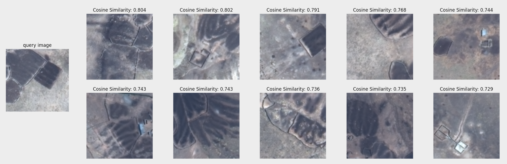

# Image to Image Retrieval (IIR)

This task evaluates the model’s ability to retrieve semantically similar archaeological loci image **without additional fine-tuning**. Given a query image, the system ranks database images by cosine similarity (using the class token) and returns the top-k matches.  

This approach enables rapid dataset expansion — starting from a small set of labeled loci image, it can automatically discover and group related samples across unexplored regions.


## Installation (Conda)
We use the [FAISS](https://github.com/facebookresearch/faiss) library for fast, simple image-to-image retrieval. To set up the Conda environment, follow the step-by-step install instructions in [faiss_install.md](faiss_install.md). 

As a reference, both [requirements.txt](requirements.txt) and [environment.yaml](faiss_py10.yaml) are provided for environment setup, check package versions if needed.


## Dataset Preparation 

All images (i.e., database) are stored as `.npy` files inside a single folder. Each image (`numpy array`) with 8 spectral bands/channels, having a shape of `(256, 256, 8)` and a data type of `np.uint8`. 

```text
/path/to/dataset/folder/
├── *.npy
├── ...
└── ...
```
In our paper, we evaluate the mean average precision (mAP) of the IIR task. Particularly, the dataset used is the binary archaeological loci classification dataset (`CLS0` or `CLS1`)used for our previous binary loci classification task, organized as:

```
/path/to/dataset/folder/
├── CLS0-*.npy
├── CLS0-*.npy
├── CLS1-*.npy
├── CLS0-*.npy
├── CLS1-*.npy
├── ...
└── ...
```

## Implementations 

An example for zero-shot image-to-image retrieval using the DeepAndes pre-trained backbone is provided: [deepandes_feature_extract.ipynb](image_retrieval/deepandes_feature_extract.ipynb). Some parameters are defined.

```python
pretrained_weight = '/path/to/teacher_checkpoint.pth'  # Path to pre-trained checkpoint
device = torch.device("cuda:0")                        # Specify GPU index 
path_to_all_images = '/path/to/dataset/folder/*.npy'   # Path to all database images
number_to_retrieve = 10                                # Top-k retrieval by cosine similarity

query_image_path = '/path/to/CLS1-7760-223.npy'        # A example query loci image for retrieval
```
In our work, we display the image using channels/bands 4, 2, and 1 as RGB for visualization purposes only. The example below shows a query image (active corrals — dark areas indicate animal use) and the top-10 retrieved images based on cosine similarity.





## Other Baseline Models Comparison

- MAE — Masked Autoencoder
- MoCo-V2 — Momentum Contrast v2
- SatMAE — A Satellite MAE baseline
- Scratch — randomly initialized ViT-L (no pre-training)

<br>

## Citing Our Work

If you find this repository useful, please consider giving a star ⭐ and citation 🦖 Thank you:)

```
@article{guo2025deepandes,
  title={DeepAndes: A Self-Supervised Vision Foundation Model for Multi-Spectral Remote Sensing Imagery of the Andes},
  author={Guo, Junlin and Zimmer-Dauphinee, James R and Nieusma, Jordan M and Lu, Siqi and Liu, Quan and Deng, Ruining and Cui, Can and Yue, Jialin and Lin, Yizhe and Yao, Tianyuan and others},
  journal={arXiv preprint arXiv:2504.20303},
  year={2025}
}
```
<br>

## Contact 

For questions or contributions, open an issue or pull request. We are looking forward to your feedback!

Contact: Junlin Guo (junlinguo1@gmail.com), Yuankai Huo (PI)(yuankai.huo@vanderbilt.edu), Steven Wernke (PI)(s.wernke@Vanderbilt.Edu), and Parker VanValkenburgh (parker_vanvalkenburgh@brown.edu)